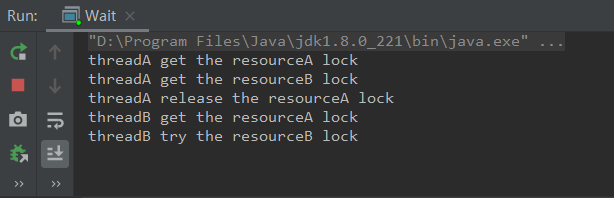

#### 首先了解什么是线程

线程是进程的一个实体，线程本身不会独立存在

进程是代码在数据集合上的一次运行活动，是系统进行资源分配和调度的基本单位，线程则是进程的一个执行路径

一个进程至少包含一个线程，进程中的多个线程共享进程资源

操作系统将资源分配给进程，CPU资源比较特殊，是分配到线程的，真正占用CPU资源运行的是线程。所以**线程是CPU分配的基本单位**。

> 面试题——进程与线程的区别
>
> 分析思路：
>
> 1、定义不同
>
> 定义不同：进程是系统资源和分配的调度单位，线程是进程的一个执行单元，是CPU资源调度的基本单位。
>
> 2、关系 有进程再有线程
>
> 关系：进程是程序的一次运行，线程是进程的一个执行路径，线程依附于进程存在
>
> 3、创建的开销不同
>
> 4、通信方式不同

#### 线程的三种创建方式

1、实现`Runnable`接口的`run`方法

实现`Runable`接口就会避免Java单继承造成的影响

```java
public class RunableTask implements Runable {
    @Override
    public void run() {
        System.out.println("runnable");
    }
}

public static void main(String[] args) {
    RunableTask task = new RunableTask;
    new Thread(task).start();
}
```

2、继承`Thread`类重写`run`方法

使用继承通过this就可以获取当前线程，无须使用`Thread.currentThread()`

由于Java不支持多继承，继承Thread类，不能再继承其他的类

```java
public class MyThread extends Thread {
    @Override
    public void run() {
        System.out.println("Thread child");
    }
}

public static void main(String[] args) {
    MyThread thread = new MyThread;
    thread.start();
}
```

3、使用`FutureTask`方法

与以上两种方法不同，使用`FutureTask`，可以获得线程执行结果通过`FutureTask`中`get`方法获取，返回值类型可以指定，下面代码中返回值类型是`String`

```java
public class CallTask implements Callable<String> {
    @Overide
    public String call() throws Exception {
        return "FutureTask";
    }
}

public static void main(String[] args) {
    FutureTask<String> futureTask = new FutureTask<>(new CallTask());
    new Thread(futureTask).start();
    try {
        String result = futureTask.get();
        System.out.println(result);
    } catch (Exception e) {
        e.printStackTrace();
    }
}
```

Thread的对象调用start方法后，线程处于就绪状态，也就是说获取了除CPU资源以外的其他资源，获得CPU资源之后，线程就处于运行状态了。

#### 线程使用的函数详解

`wait();`

`wait()`使线程阻塞，直到其他线程调用`notify()` 或者 `notifyAll()`

其他线程调用阻塞线程的`interrupt()` 会抛出`InterruptedException`异常

线程在没有获取监视器锁的情况下，调用wait()方法，会抛出`IllegalMonitorStateException`异常

为了避免虚假唤醒（一个线程在没有被其他线程唤醒，或中断，或等待超时的情况下，由阻塞状态变为运行状态），使用while循环不断的判断线程被唤醒的条件有没有被满足。

```java
synchronized (obj){
    while (条件不满足){
        obj.wait();
    }
}
```

1、`wait(long timeout);`

`timeout`超时参数，共享对象在`timeout`ms内超时返回，设置为0，相当于调用`wait()`

2、`wait(long timeout,int nanos);`

`nanos>0`的情况下，timeout自增

```java
public final void wait(long timeout, int nanos) throws InterruptedException {
    if (timeout < 0) {
        throw new IllegalArgumentException("timeout value is negative");
    }

    if (nanos < 0 || nanos > 999999) {
        throw new IllegalArgumentException(
            "nanosecond timeout value out of range");
    }

    if (nanos > 0) {
        timeout++;
    }

    wait(timeout);
}
```

一个wait（）方法的实例帮助更好的理解wait方法

```java
public class Wait {
    private static volatile Object resourceA = new Object();
    private static volatile Object resourceB = new Object();

    public static void main(String[] args) throws InterruptedException {
        Thread threadA = new Thread (new Runnable(){
            public void run() {
                try {
                    synchronized (resourceA) {
                        System.out.println("threadA get the resourceA lock");
                        synchronized (resourceB) {
                            System.out.println("threadA get the resourceB lock");
                            System.out.println("threadA release the resourceA lock");
                            resourceA.wait();
                        }
                    }
                } catch (InterruptedException interruptedException) {
                    interruptedException.printStackTrace();
                }
            }
        });
        Thread threadB = new Thread (new Runnable(){
            public void run() {
                try {
                    synchronized (resourceA) {
                        System.out.println("threadB get the resourceA lock");
                        System.out.println("threadB try the resourceB lock");
                        synchronized (resourceB) {
                            System.out.println("threadB get the resourceB lock");
                            System.out.println("threadB release the resourceA lock");
                            resourceA.wait();
                        }
                    }
                } catch (InterruptedException interruptedException) {
                    interruptedException.printStackTrace();
                }
            }
        });

        threadA.start();
        threadB.start();

        threadA.join();
        threadB.join();
        System.out.println("System is over");
    }
}
```

执行结果，`threadA`没有释放资源B，所以`threadB`一直在等待`resourceB`，系统也没有结束。



如果在`threadA`中释放掉`resourceB`，`resourceA.wait();`之后加入` resourceB.wait();`结果还是和之前的一样，是什么原因？

共享变量调用自己的`wait()`方法只会释放当前共享变量的锁，当前线程还持有其他共享变量的锁时不会被释放的。

3、`notify();`

一个线程调用共享变量的notify()方法，会唤醒一个共享变量上调用wait()的线程。一个共享变量上可能有多个被挂起的线程，唤醒哪个线程是随机的。

4、`notifyAll();`

会唤醒在该共享变量由于调用wait方法而被挂起的所有线程。

5、`join();`

等待线程执行终止：等待某些线程执行完毕后再继续进行

6、`sleep();`

调用sleep()暂时让出指定时间的执行权，期间不参与CPU的调度，但是该线程持有的监视器锁不会释放。

7、`yield();`

让出CPU执行权，进入下一轮调度。线程让出CPU执行权，但是仍然处于就绪状态。线程调度器会从就绪队列中获取一个优先级别最高的线程，也有可能会调度到刚刚让出CPU的线程。

##### sleep和yield的区别：

线程调用sleep时调用线程会被阻塞挂起指定时间，期间线程调度器不会调用该线程。

线程调用yield时线程知识让出自己剩余的时间片，线程没有被挂起还是处于就绪状态，可以随时被线程调度器继续调用。

#### 线程中断

#### 理解线程上下文切换

#### 线程死锁

#### 守护线程和用户线程

#### `ThreadLocal`


